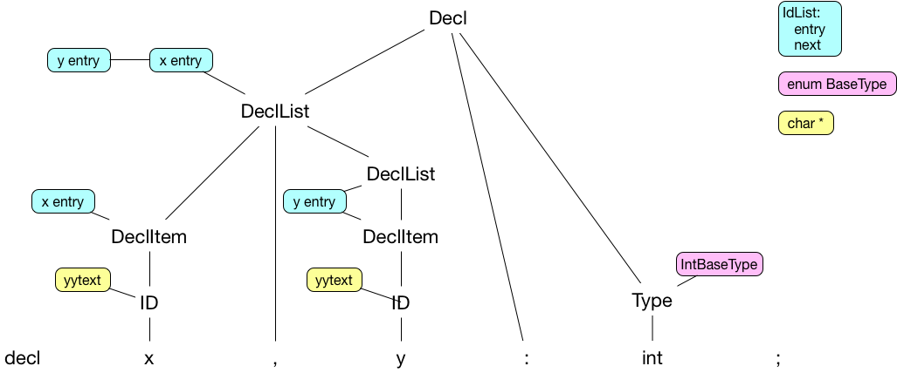
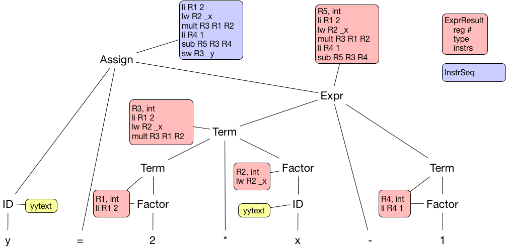
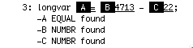
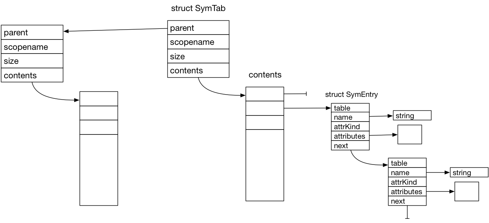

# CS 442 - Compiler Construction
## Y-To-ASM

This repository contains an informal compiler for the "Y" language. There are some test programs included along with test drivers and a make file. A more formal README will be completed within the next two weeks; for now, I have included the original compiler assignments in descending order.

## Semantics Part 2

This repository contains files to be addded to your main project repository to include the semantic processing capabilities to compile programs of the language Y. 

## The Assignment

- Step 5, 5 pts, Implement increment and decrement either as operators or builtin functions.
- Step 6, 10 pts, Implement boolean operators.
- Step 7, 10 pts, Implement a FOR loop.
- Step 8, 10 pts, Implement a LOOP construct and BREAK statment.
- Step 9, 10 pts, Implement constants and constant expression evaluation.
- Step 10, 15 pts, Implement a SWITCH construct.
- Step 11, 15 pts, Implement an array data type.
- Step 12, 15 pts, Implement function calls for parameterless functions.
- Step 13, 15 pts, Implement function parameters.
- Step 14, 20 pts, Implement local variables in functions.

The repository contains a selection of test programs that implement various combinations of these features. You can make your own test programs but they should actually do something. 

## Extra Steps for Grading

To indicate which of these features you have implemented please add the following to your make file

    sem2test:	 feature1 feature2 etc
    
    feature1:    Y
                 echo "Some message identifying the feature"
                 rm -f f1.asm
                 ./Y f1
                 cat f1.asm
                 spim -noexception -file f1.asm < f1.in
                 
    feature2:    etc
    
Remember that the action commands must be preceeded by one or more tab characters (not spaces). To test your submission I will execute "make sem2test" and this will then run the tests for each of your features. The "f1.in" file is only required if the test program takes input from the terminal. 

## What To Do

- Do not fork this repository on Gitlab, instead
- On your development machine, in a location different than your assignment repository, clone this project. Your assignment repository will continue to accumulate all files for the project. 
- Copies the files from this repository to your assignment repository.
- Discard the clone of this repository.
- Implement the required capabilities. 
- When complete, "make clean" to remove object files and executables, use git to add and commit your changes and push the project back up to your repository. Rememger to create an issue in Gitlab with me as the assignee indicating that your submission is ready for grading. 

# CS 442 - Compiler Construction
## Semantics Part I

This repository contains files to be addded to your main project repository to include the semantic processing capabilities to compile programs of the Y language (one of the few letters for which there is not a language). The repository contains

- Y.c
 - This is the test driver for the assignment. This driver takes one argument, the base name of the source file. It appends ".src" and ".asm" "to the base name and opens these files. It then starts the main parse function produced by yacc/bison.

- YGrammar.y
 - The yacc/bison input describing the grammar rules and actions. This file contains a starting point that covers all of the required things and production rules for declaration statements. You will need to complete this file.

- YScanner.l
 - The lex/flex input describing the tokens required by the parser. It should include comment nesting capabilities.

- YCodeGen.h/.c
 - The contains support functions for creating, manipulating and writing assembly code sequences. The implementation is complete.

- YSemantics.h/.c
 - This will contain the implementation of the semantic actions used in compilation. It has stubs for the semantic actions used for variable declarations as well as some of the required data structures.

- Makefile
- This file has been updated to include rules for this portion of the project. There are targets "y#test" for each of the five test files as well as a target "ytest" that runs all tests.

- y#.src/.in/.asm, yfactors.src/.in/.asm
 - Various source files for testing.

Detailed information on the MIPS instruction set and SPIM simulator can be found at

* [http://pages.cs.wisc.edu/~larus/HP_AppA.pdf](http://pages.cs.wisc.edu/~larus/HP_AppA.pdf)

Testing will be done using the spim command line simulator. On OS X this can be obtained with "brew install spim". On linux it can be obtained with "sudo apt-get install spim". Downloads at [https://sourceforge.net/projects/spimsimulator/files/](https://sourceforge.net/projects/spimsimulator/files/). Another alternative is the MARS simulator but there are some differences in behavior.

## The Assignment

- Step 1, 25 pts
  - Implement the necessary semantic actions for variable declarations. y1.src tests this part.
  - Notes on most of the things you need to do and remember.
        - YGrammar.y contains grammar rules for declarations and corresponding semantic action functions. Variable declarations are of the form "decl x, y, z : int;". It also lists the required "union" fields and the correspondence of nonterminals to "union" fields.
        - YSemantics.h contains the declaration of the semantic action functions, the symbol table identifier attribute struct, a struct IdList to hold symbol table entry references and a struct TypeDesc to represent a type.
        - YSemantics.c contains some global variables, an init function, a list symbol table function and stubs for the semantic action functions.
        - struct IdList is used to form a linked list of SymTab entries as identifiers are encountered
        - struct TypeDesc is used to define a declaration type - it may become more complicated in the future
        - struct Attr is used with SymTab entries to carry information about an identifier
        - ProcDecls() takes a linked list of struct IdList along with a base type and updates the symbol table entry's attributes to reflect the delcared type.
        - AppendIdList() joins a new struct onto to an existing list
        - ProcName() places an identifier in the symbol table, after checking if it is already present, and creates/sets an empty struct attr
        - ProcFunc() creates the instruction sequence for the function including entry and return and attaches it to the function identifiers attr struct



- Step 2, 25 pts
 - Add rules and semantic actions to compile simple expressions and assignment statements. Implement get() and put() functions for I/O of simple data types. Get() should be allowed in place of an identifier in expressions and put() should be considered a statement on its own. These are implemented in assembly with syscalls. Y2.src tests this part.
 - Notes on most of the things you need to do and remember.
        - Write grammar rules for an assignment statement and make it one of the options for Stmt. AssignStmt should be "Id '=' Expr".
        - Expr should be "Expr AddOp Term" or "Term". Term should be "Term MultOp Factor" or "Factor". Factor can be a parenthesized expression, the negation of a factor, an integer/character literal or an identifier.
        - Create a struct ExprResult which holds both the code sequence that computes the expression and the register number where the result is located when the code executes. This will get added as an option for the "union" and associated with certain nonterminals. You may also want an enumerated type for the various operators or simply use the operator character itself.
        - The semantic action for compiling the AddOp will receive an ExprResult for the incoming Expr and Term. The incoming code sequences are concatenated and an instruction for the operator is generated and added to the end. The registers for the operator instruction come from the incoming ExprResults and a new temp register obtained from the CodeGen module.
        - For an integer literal an ExprResult is created containing a load immediate ("li") instruction with a new temp register. An identifier produces a load word ("lw").
        - The AssignStmt receives an Id and an ExprResult, generates a store word ("sw") and appends to the end of the ExprResult code sequence and passes along the instruction sequence (not the whole ExprResult).
        - CodeGen module usage: AvailTmpReg() returns the number of an available register. TmpRegName(reg#) takes a register number and returns the char string name for use in an instruction (e.g. TmpRegName(3) returns "$t3"). ReleaseTmpReg(reg#) make the register available again. For every call to AvailTmpReg() there must somewhere be a corresponding ReleaseTmpReg() call.
        - In compiling an operator, when the language gets more complex, it will be necessary to check that the operands are of compatible types. This means that the ExprResult struct should also have a field for the result type.
        - The action for get() will generate the instructions for the syscall to read an integer and put the result in a new temp register. It will return an ExprResult.
        - The put() statement will generate the instruction for the syscall to write an integer. There are syscalls to print an integer and to print a character.
        - ChrLit should allow things like 'a' and '\n'.



- Step 3, 25 pts
 - Add rules and semantic actions for "if/then/else" and "while" loops. Y3.src tests this part.
 - Notes on most of the things you need to do and remember
        - need a CondResult struct similiar to ExprResult, remembers the code sequence and the label used in the conditional branch instruction
        - conditional branch is opposite of the comparison operator, instructions are bge, bg, ble,bl, bne, beq
        - common syntax does allow for dangling else, yacc gives shift/reduce warning but prefers shift over the reduce which effectively associates an else to the inner if
        - if/then/else uses label generated by condition as first thing following then sequence, when an else clause is present, then sequence ends with branch to new label which follows the else sequence and the condition label comes at the beginning of the else clause
        - while needs label at start of condition instruction sequence, conditional branch label follows the body, the body ends with a branch to the top of the loop


- Step 4, 25 pts
 - Add rules and semantic actions to allow string literals in put() statements. Y4.src tests this part.
 - Notes on most of the things you need to do and remember
        - use a separate symbol table to hold string literals, need different attribute record for string literals than the one used for identifiers, for string literals the attribute remembers the label used for the string literal in the data section

- There is a fifth test program, yFactors.src that exercises all of the steps to calcuate the factors of a given number.


## What To Do

- Do not fork this repository on Gitlab, instead
- On your development machine, in a location different than your project repository, clone this project. Your project repository will continue to accumulate all files for the project.
- Copy the files from this repository to your project repository.
- Discard the clone of this repository.
- Implement the required capabilities. Make sure your author header comment is in YSemantics.c.
- When complete, "make clean" to remove object files and executables, use git to add and commit your changes and push the project back up to your repository. Remember to create an issue in Gitlab with me as the assignee indicating that your submission is ready for grading.


# CS 442 - Compiler Construction
## Parser

This repository contains files to be addded to your main project repository to include the Parser capabilities. The repository contains

- Parse.c
 - This is the test driver for the assignment. This driver takes one argument, the name of the source file to read. It then starts the main parse function produced by yacc/bison.

- Grammar.h
 - An include file exposing the yyparse() function generated by yacc/bison.

- Scanner.h
 - An include file exposing yylex(), yytext and yyleng provided by Flex.

- ParserGrammar.y
 - The yacc/bison input describing the grammar rules and actions. A starting point for this file is supplied. You will need to complete it.

- ParserScanner.l
 - The lex/flex input describing the tokens required by the parser. A mostly empty file is supplied. You will complete this by using the RDScanner.l token definitions with the comment nesting capabilities implemented in the previous Scanner.l.

- Makefile
 - This file has been updated to include rules for this portion of the project.

Building ParserGrammar.o using the yacc "-d" option creates a y.tab.h file from the %token information in the yacc file. The y.tab.h file contains symbolic token names and corresponding numbers and is included in ParserScanner.l

## The Assignment

- Step 1
   - Using yacc/bison implement a parser for the same grammar used in the recursive descent assignment with two changes.
      1. remove the float literal token and option for Factor
      1. change Assign production to provide an opportunity to capture the left hand side identifier

      ```
      Assign : LHS ASSIGN_TOK Expr
      LHS    : IDENT_TOK
      ```

   - This will involve completing ParserGrammar.y and ParserScanner.l.
   - This step should show success in parsing the first test file and an error parsing the second.

- Step 2
 - Using the same grammar as in Step 1, add semantic actions that will print to stdout the postfix form of any expression encountered. ParserGrammar.y defines YYSTYPE (the type carried by grammar non-terminal symbols) to be "long". This means it can carry either an integer or a char pointer but you may need to cast types to avoid compiler warnings. Actions will either be printf statements of ``$#`` symbols or assignments to the ``$$`` symbol. Some grammar rules may not have actions.


## What To Do

- Do not fork this repository on Gitlab, instead
- On your development machine, in a location different than your assignment repository, clone this project. Your assignment repository will continue to accumulate all files for the project.
- Copies the files from this repository to your assignment repository.
- Discard the clone of this repository.
- Implement the required capabilities.
- When complete, "make clean" to remove object files and executables, use git to add and commit your changes and push the project back up to your repository.
- Finaly, create an issue on your repository, with me as the reporter assignee, indicating that it is ready for grading.


#

# CS 442 - Compiler Construction
## RecDescent

This repository contains files to be added to your main project repository to include the Recursive Descent capabilities. The repository contains

- RecDescent.c
 - This is the test driver for the assignment. This driver accepts an "-l" option and a filename. The filename is the source file name. If "-l" is specified all source lines are echoed to stdout otherwise only lines with associated messages are echoed. After checking the options it begins the recursive descent process.

- RDGrammar.h and RDGrammar.c
 - These contain the implementations of the recursive descent functions. The ".h" file lists all the recursive functions even though only the initial nonterminal function needs to be exposed.

- RDSupport.h and RDSupport.c
 - These contain the implementations of support functions in particular matching an expected token.

- RDScanner.l
 - This specifies the token types used in this project. It will reuse the Scanner.h file from the previous assignment to expose the functions and data created by Flex in compiling this specification.

- RDTokens.h
 - This provides symbolic constants for the required token types.

## The Assignment

- Complete RDScanner.l to specify regular expressions and actions for the required token types. The regular expressions will be similar to previous assignments.

- Complete RDGrammar.c to provide the implementation of the required recursive descent functions. If a function corresponds to a single production rule then it will simply be a sequence of token tests. If a function corresponds to multiple productions then you will need a switch statement, based on the current token, which selects the correct right-hand-side sequence to follow. In C, cases in a switch fall through unless there is a break. Consequently, if more than one token corresponds to the same right-hand-size then simply list the cases with no breaks in between and implement the right-hand-side in the last case.

## What To Do

- Do NOT fork this repository on Gitlab, instead
- On your development machine, in a location different than your assignment repository, clone this project. Your assignment repository will continue to accumulate all files for the project.
- Copies the files from this repository to your assignment repository.
- Discard the clone of this repository.
- Implement the required capabilities.
- When complete, "make clean" to remove object files and executables, use git to add and commit your changes and push the project back up to your repository.
- Finaly, create an issue on your repository, with me as the reporter assignee, indicating that it is ready for grading.

#

# CS 442 - Compiler Construction
## Scanner Assignment Respository

This repository contains files to be added to your main assignment repository to include the Scanner portion of the project. The repository contains

- ScannerDriver.c
 - This is the test driver for this portion of the project. The driver opens source and listing files and repeatedly requests the next token from the scanner. Depending on the token type different actions are taken. The "@INIT" token causes a symbol table to be created. Identifiers are stored in this symbol table. A running sum of integer literal tokens and float literal tokens is maintained. The "@DUMP" token displays the integer and float sums and the symbol table contents is sorted order.  
- Scanner.l
 - This is the starting point for the scanner definition. It contains the outline of the needed scanner rules.
- Scanner.h
 - This exposes as an include file the functions and data provided by the lex/flex generated scanner.
- ScanTokens.h
 - This is an include file containing defines for the various token types.
- Makefile
 - The Makefile containing new rules and definitions for the scanner component.
- ScannerSource
 - The input source.
- ScannerListing
 - The listing output of the source (lines with messages only).
- ScannerOutput
 - The stderr output of the driver.
 -
## The Assignment

 - Scanner.l contains rules for the @INIT, @DUMP and Identifier tokens. Extend these rules to incorporate nestable comments (both "/* ... */" comments, which may be nested, and "through to the end of line" comments "// ...."). Include the code necessary to only return tokens when not inside a comment. Also include rules for integers, floats and at least one symbol. You will need to add defines for these token types to ScanTokens.h. Integer and float literals should allow an immediately preceding "-" to negate values. This can either be done with separate regular expressions for the positive and negative cases or using the lex/flex question mark operator (e.g. "a?" represents an optional "a").
 - ScannerDriver.c contains most of the required code. The cases for @INIT and @DUMP are supplied. @INIT creates a symbol table and @DUMP displays the contents of the table. These write to stderr. You need to supply code for the IDENT_TOK case to add the token text to the symbol table with an appropriate attributes structure keeping track of the occurrence count. This case should set messages indicating the action taken (i.e. no action because no symboltable, found with an occurrence count and added as new identifier). You will also need to add cases for integer and float literals. These cases should update the accumulated sum of integer and float literals. You may use the ``atoi()`` and ``atof()`` functions to convert the token text to numeric values. Both functions are able to handle negative values.The @DUMP case displays the running sum of integer and float literals and the symbol table contents.

## What To Do

- DO NOT FORK this repository on Gitlab, instead
- On your development machine, in a location different than your assignment repository, clone this project. Your assignment repository will continue to accumulate all files for the project.
- Copy the files from this repository to your assignment repository.
- Discard the clone of this repository.
- Implement the required capabilities.
- When complete, "make clean" to remove object files and executables, use git to add and commit your changes and push the project back up to your repository.
- Finaly, create an issue on your repository, with me as the reporter assignee, indicating that it is ready for grading.

#

# CS 442 - Compiler Construction
## IOMngr Repository

This repository contains files to be added to your main project repository to include the IOMngr module. The IOMngr is responsible for

* returning source characters to the caller one at a time
* associating messages (e.g. compiler errors or warnings) with source lines
* writing processed source lines to stdout along with associated messages

The repository contains

- IOMngrDriver.c
    - This is the test driver for the assignment. This driver opens the source and listing files and repeatedly requests the next character from the source file. When specific patterns of characters are seen it posts appropriate messages.  

- IOMngr.h
    - The include file defining the functions implemented by the IOMngr.

- IOMngr.c
	- A stub for the implementation file.

- IOMngrSource
    - A source file for testing.

- IOMngrSource-#.out
    - The output from testing.

- Makefile
    - An extended Makefile containing the rules required for building and testing the project.

## The Assignment

Complete the IOMngr.c file by implementing the functions defined in SymTab.h. Once the source file is opened, GetSourceChar() will return the next available character or EOF if the end of file has been encountered. GetSourceChar() is also responsible for echoing source lines to stdout. Depending on the mode of operation either all lines or only lines with associated messages are echoed to stdout.

When written to stdout the source line

```
longvar = 4713 - 22;
```

will appear as



The source line is preceeded by a line number (use a max of 5 digits). Messages are associated to columns in the source with marker tags. Highlighting of marker tags and underlining of source text is accomplished using ANSI Terminal Escape Codes. The necessary escape codes, which can be included in the printf format string, are

* ``\033[7m`` - turn on reverse highlighting
* ``\033[4m`` - turn on underlining
* ``\033[0m`` - reset all attributes

Because of the required behavior for marking message locations in the source line and displaying messages immediately below source lines it is necessary for the implementation to read source lines in their entirety, buffer them internally, and return single characters from the buffer as requested. Prior to reading a new buffer line the current line must be written to stdout along with any associated messages. Depending on the lineEchoMode set when OpenSource() is called either all lines are written to stdout or only lines with associated messages.

The IOMngrDriver implements a table based state machine to recognize a few simple token types. Some of these token types generate messages. The driver tests that GetSourceChar() will continue to return EOF after the end of file is encountered by requiring that EOF be returned 3 times before exiting. If PostMessage() is done for the EOF token the message lines will all appear to use marker "A" since there really is no line corresponding to the EOF.

The driver supports two command line options.

* ``-m`` - sets lineEchoMode to true
* ``-u`` - close and exit on unknown token

The first controls whether all lines are echoed to output or only lines with messages. The second is used to test output is handled correctly when processing is aborted before the end of the input file.

The project can be tested with ``make iotest`` which will invoke 3 different tests (e.g. all lines listed, only message lines listed, exit on unknown token).

## What to Do

- DO NOT FORK this repository on Gitlab, instead
- On your development machine, in a location different than your assignment repository, clone this project. Your original Project repository will continue to accumulate all files for the project.
- Copy the files from this repository to your Project repository. The new Makefile will replace the existing copy.
- Discard the clone of this repository.
- Complete the IOMngr.c file by implementing the required functionality.
- When complete,
    - "make clean" to remove object files and executables
    - use git to add and commit your changes to your local repository
    - use git to push the project back up to your GitLab account
    - I should already be a member of your project repository
    - create an issue on your project repository, listing me as assignee, with a title of "Submit for grading"

#

# CS 442 - Compiler Construction
## SymTab Assignment Respository

This repository initially contains the SymTab Project files:

- SymTabDriver.c
    - The main test driver for the assignment. This driver reads lines from an input file. Each line contains one of the following commands.
        - createtable table_size table_name
        - insert name value
        - transfertable existing_table_name new_table_size new_table_name
        - displaytable table_name
        - destroytable table_name

- SymTab.h
    - The include file defining the required structures and functions for the implementation.
- SymData-N.in
    - Files of test data using of the above commands.
- SymData-N.out
    - Expected output for the sample input.
- Makefile
    - The Makefile containing the dependency rules as well as "clean", "symtest" targets.

## The Assignment

Starting with the supplied SymTab.c file, implement the functions defined in SymTab.h. The implementation will use a hash table structure containing singly linked lists of names, with equal hash values, along with their attribute structures.



Since ``struct SymTab`` includes a parent pointer it is possible to create a chain of tables to support nested scopes.

Creating a table involves allocating space for the ``struct SymTab`` and then space for the ``contents`` array of pointers to the head nodes of the linked lists. There is no need for sentinel nodes. Each index in the contents array is either NULL indicating no list for the hash value or a pointer to a node on the list. New nodes are most easily added to the beginning of the list.

Names entered in a table can have associated attribute data. The Symbol Table knows nothing about the structure of associated attribute data. Consequently, it does not know how to free this data. The ``DestroySymTab`` function only frees the memory allocated by this module. The user must ensure that all user allocated memory forming the associated attribute data is separately freed.  

The InvokeOnEntries() function provides a mechanism for iterating through all entries in a table, and optionally its parent tables as well, applying a supplied work function to each entry. This can be used to free allocated attribute memory. It can also be used for other purposes such as displaying all of the entries in a table.

The ``attrKind`` fields allows the user to distinguish between several possible kinds of attribute data if necessary. It's interpretation is determined the user.  

The SymTabDriver.c operates in two modes. When invoked as "./SymTabDriver" it runs a "sanity" check to verify that the implementation is able to create a table and enter/find names. When invoked as "./SymTabDriver aDataFile" the commands contained in aDataFile are executed with output being written to stdout.

The project can be tested with ``make symtest`` which will invoke the driver in both forms.

You may want to use several functions from string.h such as strlen(), strdup(), strcmp().

## What To Do

- In GitLab, fork this project to make a copy under your GitLab account, it will still be called "Project"
- Clone _your_ copy of the project to your development machine.
- Implement SymTab.c and test.
- When complete,
    - ``make clean`` to remove object files and executables
    - ``git add .`` to add your changes
    - ``git commit -m "commit message"``
    - ``git push -u origin master``
    - add me as a "reporter" member of your project repository
    - create an issue on your project repository, listing me as assignee, with a title of "Submit for grading"

#
